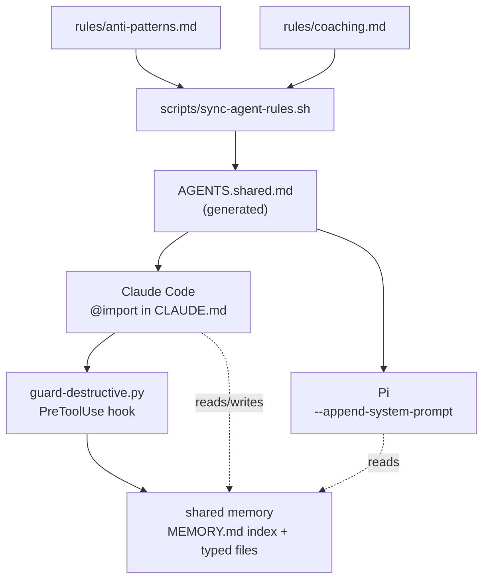

# Architecture

Three ideas, wired together:

1. **One source of behavioral rules**, consumed by every agent.
2. **A safety hook** that holds irreversible actions for explicit confirmation.
3. **A typed, bounded memory** shared across sessions.



ASCII view, if the diagram doesn't render:

```
      rules/anti-patterns.md   rules/coaching.md
                  \               /
                   \             /
              scripts/sync-agent-rules.sh
                        │
                        ▼
              AGENTS.shared.md  (generated — never hand-edited)
                  ┌─────┴──────┐
                  ▼            ▼
             Claude Code       Pi
             (@import)   (--append-system-prompt)
                  │
                  ▼
          guard-destructive.py   ← PreToolUse: holds push / publish / reset
                  │
                  ▼
          shared memory  ← MEMORY.md index + typed memory files
```

## 1. One source of rules

The trap with multiple agents is rule drift: you tell Claude one thing, Pi another, and a
month later they behave differently on the same repo. The fix is a single canonical
source.

[`rules/`](../rules/) holds the human-edited rule files. Running
[`scripts/sync-agent-rules.sh`](../scripts/sync-agent-rules.sh) concatenates them into one
generated `AGENTS.shared.md`. Each agent then consumes that source through whatever
mechanism it natively supports:

| Agent | Mechanism |
|-------|-----------|
| Claude Code | `CLAUDE.md` imports the sources with `@rules/anti-patterns.md` |
| Pi | a shell `pi` wrapper passes `AGENTS.shared.md` to `--append-system-prompt` |

Edit a rule once, re-run the script, and both agents are back in lockstep. The generated
file is never edited by hand — a banner at its top says so.

## 2. The destructive-op guard

A fast auto-approve permission mode is great until the day an agent runs `git push` or
`npm publish` because it read approval of a *draft* as approval of an *action*.

[`hooks/guard-destructive.py`](../hooks/guard-destructive.py) is a `PreToolUse` hook. It
inspects each Bash command and, if the command matches a destructive or outward-facing
pattern — `git push`, `git reset --hard`, `git clean -f`, tag/branch deletion, package
publish, release create, PR merge — it returns a `permissionDecision: "ask"`, forcing an
explicit confirmation. Everything else stays fast.

It matches against the whole command string, so it still catches the dangerous verb
inside a `&&` / `;` / `|` chain, and it lets `--help` / `--dry-run` invocations through
untouched. This enforces the "implicit-authorization escalation" anti-pattern
(`anti-patterns.md` #19) at the harness level, not just in prompt text.

Wire it up in `settings.json`:

```jsonc
"PreToolUse": [
  {
    "matcher": "Bash",
    "hooks": [
      { "type": "command", "command": "bash ~/.claude/hooks/guard-destructive.sh", "timeout": 10 }
    ]
  }
]
```

## 3. Memory

Long-term context is kept as one-fact-per-file, with a single index loaded each session.
The design — four memory types, the index, and the rules that keep it from rotting — is
documented in [`memory/README.md`](../memory/README.md). Real contents stay local; only
the structure is published here.

## Design principles

- **Single source of truth beats per-agent config.** Drift is the enemy; one file edited
  once removes it.
- **Safety belongs in the harness, not just the prompt.** A hook can't be argued out of;
  prompt text can.
- **Generated artifacts are disposable.** `AGENTS.shared.md` is rebuilt on demand and is
  gitignored, so it never becomes a second source of truth.
- **Memory is bounded on purpose.** Typed, one-fact-per-file, indexed, and pruned — so it
  stays useful instead of becoming a dumping ground.
